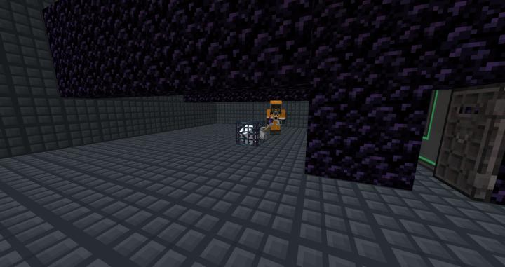

# 몹 스포터 농장

컴팩트 차원에서 안전하게 몹을 잡을 수 있는 방이다.

## 타 문서와의 관계
### 위치
<!-- tag_source_open:link_list:building_spot -->
- [컴팩트 머신 차원](../buildings/compact_machine_dimension.md)  
텔레포터 허브로 이동할 수 있다.
<!-- tag_close -->

### 참여자
<!-- tag_source_open:link_list:member_contribute -->
- [kidoxt](../members/kidoxt.md)  
가스트 몹 스포너로 제작
- [BANJUHARA](../members/BANJUHARA.md)  
몹 스포터 룸으로 개조
<!-- tag_close-->