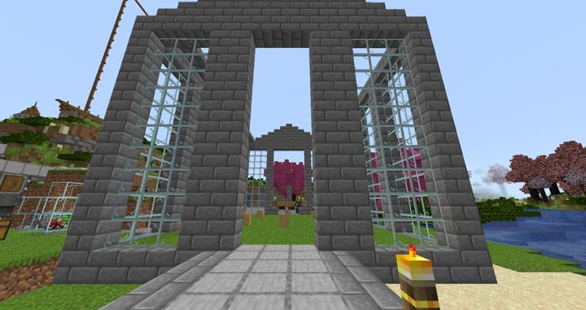
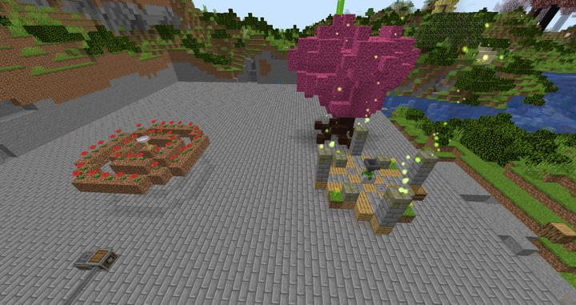

# Nature Aura 제단

Nature's Aura 모드의 기본 제단

Nature Aura의 기본 altar 및 외관을 꾸며봄.

Nature Altar 및 Offering Table
딱히 설명할게 없다... 그저 모드의 2번째 3번째 티어 건물이다.

Offering Table의 특이점으로는 물건을 바치면 번개가 치면서 하늘에서 물건이 떨어져서 보는 구경은 있지만 줍는건 귀찮다.

:::warning
그리고 여기까지하고 깨달은 것이 거북을 만들기 위해서는 인갑이 필요한데 인갑을 얻을러면 거북이 필요하는 악순환..... 거북은 결국 얻지를 못한다.  
9개가 넘는 해변을 돌아다녔으나, 거북은 보이지 않았다. 
Alax's Mobs 모드와 충돌이 난 것일 수도 있다.
:::

이후는 새로 들어온 [EconomyBang](../members/EconomyBang.md) 에게 네추럴 아우로라를 넘겼다

### 참여자
<!-- tag_source_open:description:member_contribute -->
- [kidoxt](../members/kidoxt.md)  
최초 제작 설계
- [EconomyBang](../members/EconomyBang.md)  
인수인계 받음
<!-- tag_close-->