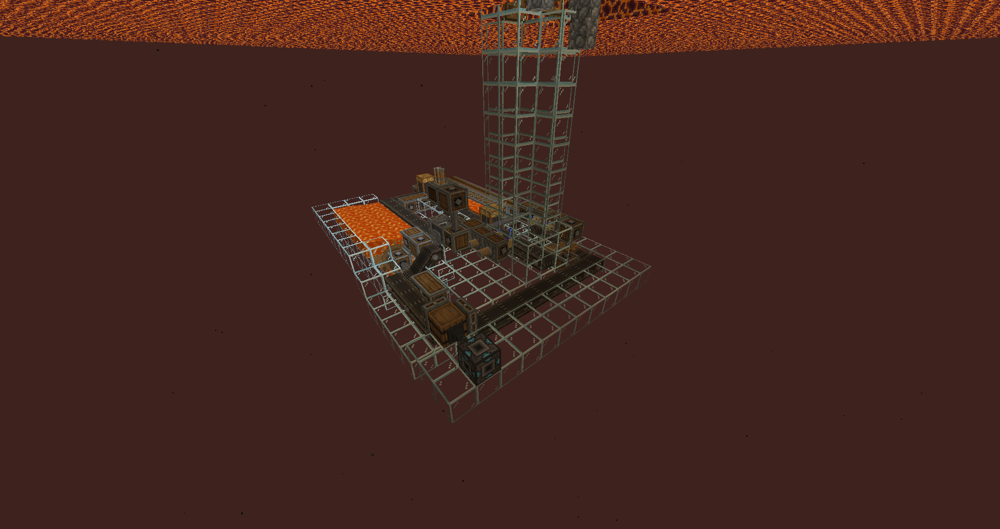
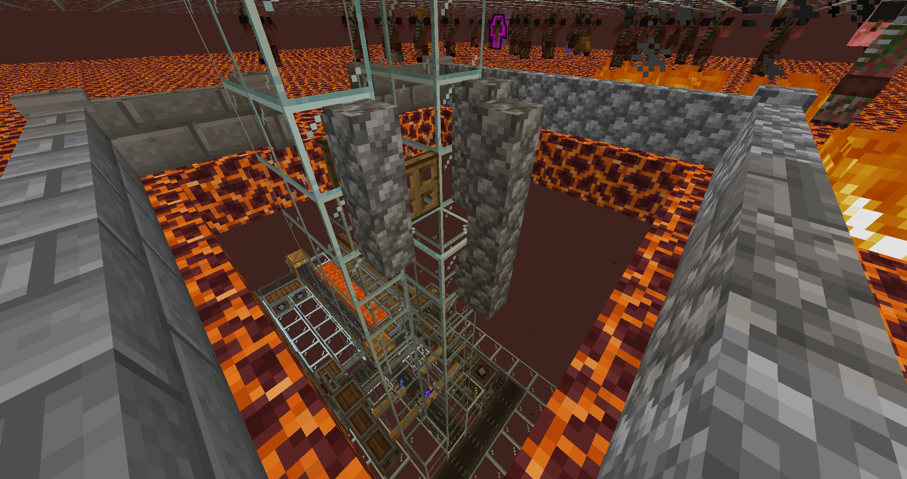
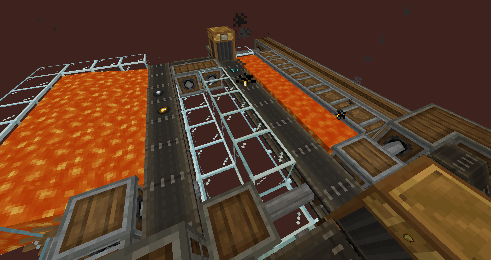
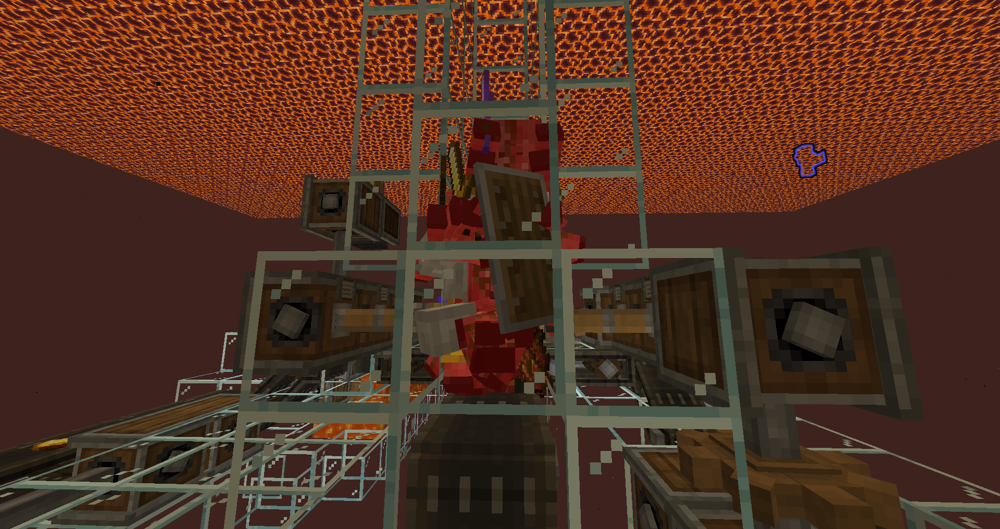

# 네더 금 농장

네더의 금농장을 목적으로 했지만 경험치 조작가 더 많이 나오는 팜  
크리에이트 로 잡다한건 다 녹여서 금조각 및 철조각으로 만들어서 철주괴 약간과 금주괴를 만들어냄  

가운데 거북알을 놓아야 완성이지만 거북을 못찾아서 임시로 직접 올라가서 때리고 내려와야함  

잡다한 템들은 전부 용암 선풍기 앞을 지나가면서 없어지고 철조각 금조각만 남음

철 조각 금조각을 모아서 주괴로 압착 시키는 과정  

약탈3검을 기계손이 알아서 때려줌

전우의 유품으로 중무장하는 좀비피글린
