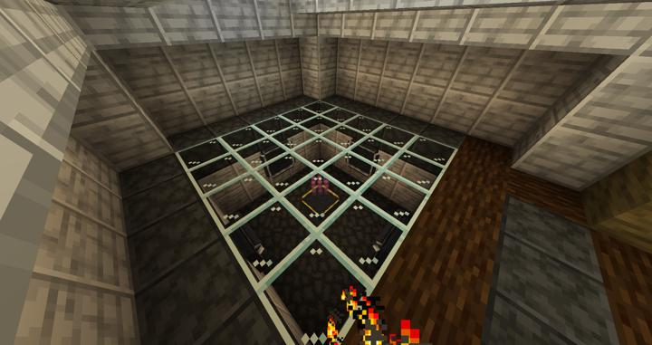

# 오컬티즘 매직 스토리지

아이템 네트워크를 사용한 대량 아이템 스토리지.

<!-- tag_target_open:frame:item_stroage_generations -->
:::tip 아이템 스토리지 시스템 변천사
마인크래프트 기본 체스트 -> Storage Drawers ->[Occultism Magic Storage](occultism_magic_storage.md) -> [Refined Storage](rs_main.md)  
:::
<!-- tag_close -->

오컬티즘 매직 스토리지는 우리 길드의 3세대 아이템 저장 시스템이다.

Storage Drawer를 사용하여 대량의 아이템을 저장할 수 있게 되었지만,
많은 아이템들 사이에서 매번 정리하고 아이템을 찾아 조합하는 시간은 점점 늘어만 갔다.

또한, 무선으로 창고에 접근할 수 없어서 매번 광질을 오래 가지 못했으며
이를 통해 아까운 다이아가 자꾸만 backpack의 공간 확장 용도로 소비되는것이 안타까워서 개발되었다.

## 시스템 사양

이 구조물이 제공했던 기능은 다음과 같다.
- 대량의 아이템을 저장 가능
- 거리제한, 차원제한 없이 무제한으로 창고에 무선 접근 가능
- 배터리를 사용하지 않으므로(occultism은 마법 모드) 전력 시스템이 열악해도 사용 가능
- 조합대가 창고 엑세서에 병합되어 있으며, 조합시 자동으로 남는 아이템을 창고에서 꺼내서 채워줌

오컬티즘이 마법모드여서, 저정도 스펙을 뽑아내려면 여러가지 마법진 및 소환진을 계속 그려야 했지만
성능을 생각할 때 굉장히 뛰어난 가성비를 자랑하며, 별도의 큰 처리 없이 tier 2 storage stabilzer로만 업그레이드 해도
수십만개의 아이템을 저장할 수 있는 기염을 토한다.

이 스토리지 시스템은 약 일주일간 사용되었고
이후 우리 길드는 4세대 스토리지로 넘어가게 된다.
[Refined Storage](rs_main.md)

## 타 문서와의 관계
### 위치
<!-- tag_source_open:link_list:building_spot -->
- [인벤토리의 제단](../buildings/inventory_altar.md)
<!-- tag_close -->

### 참여자
<!-- tag_source_open:link_list:member_contribute -->
- [jasuk500](../members/jasuk500.md)  
시스템 총괄 / 개발 / 스토리지 엑세서 배포 / 유지보수
<!-- tag_close-->