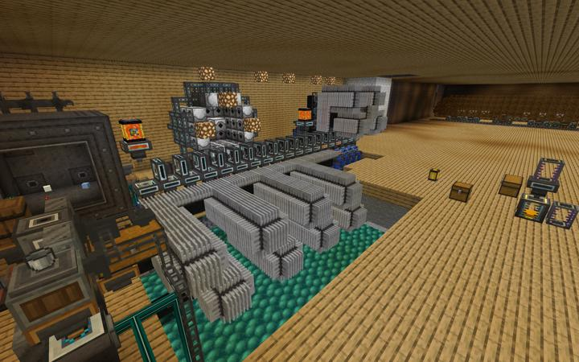
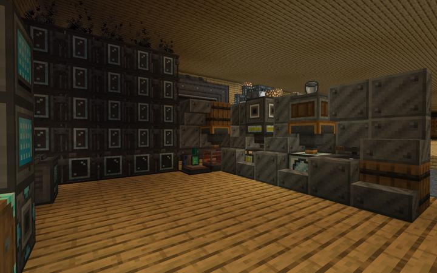
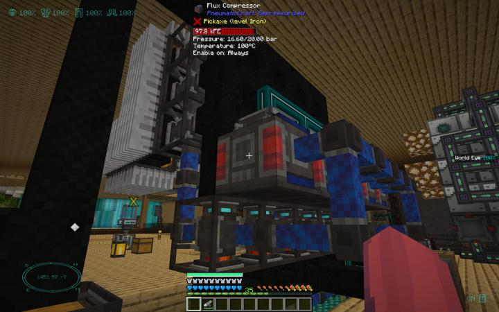
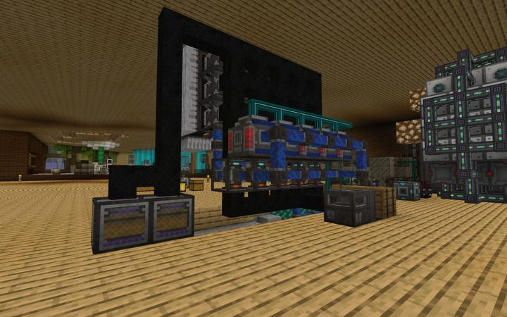
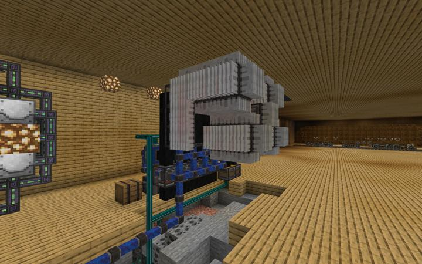
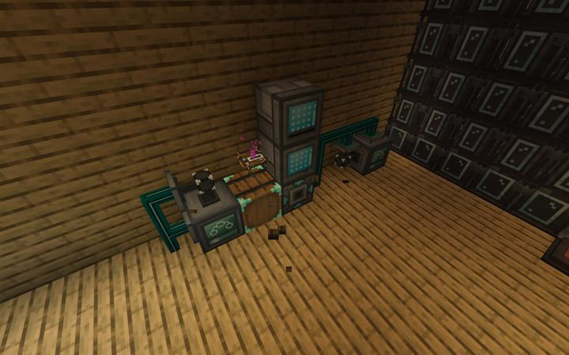
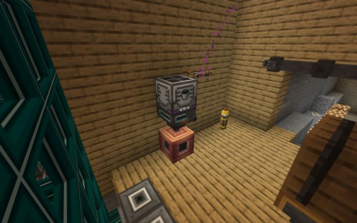

# Pnumatic Craft 정제라인

누메틱 크래프트의 각종 자원을 정제하는 곳

플라스틱 공정 자동화, PCB 제작 공전 자동화  
유압은 기본적으로는 전기 압축기 사용  
무려 xnet컨트롤러 2개 ㅋㅋㅋㅋ  
정제라인은 아마드론에서 원유를 구매 (1bucket = 1 emerald) - 정제탑에서 정제   

## 업데이트 내역

### 2023-06-13 첫 완성

:::details 사진들

:::

## 타 문서와의 관계
### 위치
<!-- tag_source_open:link_list:building_spot -->
- 길드 지하 2층
<!-- tag_close -->

### 참여자
<!-- tag_source_open:link_list:member_contribute -->
- [happyjourney](../members/happyjourney.md)  
시스템 총괄 / 개발 / 유지보수
<!-- tag_close-->