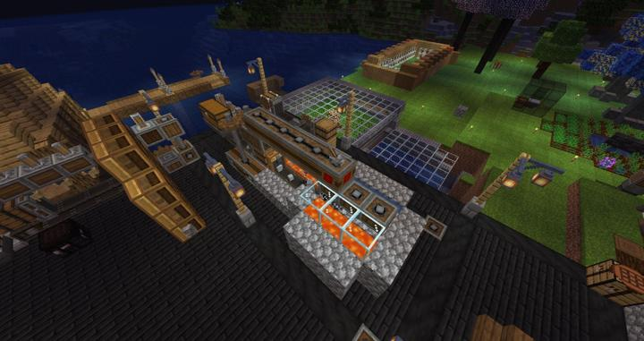
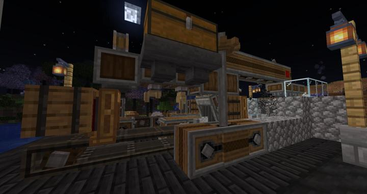

# 철도 생성기

위쪽 큰 상자에 철 조각을 넣으면 알아서 만들어줌

조약돌 생성기가 굽는것보다 빨라서 만들어놓고 2개는 때어버림
그걸로도 모자라서 기어시프트 달아서 속도를 반으로 낮춤

### 위치
<!-- tag_source_open:link_list:building_spot -->
- [Create 플랫폼](../buildings/create_platform.md)
<!-- tag_close -->

### 참여자
<!-- tag_source_open:link_list:member_contribute -->
- [kidoxt](../members/kidoxt.md)  
생산라인 및 기계 배치, 설계, 제작
<!-- tag_close-->