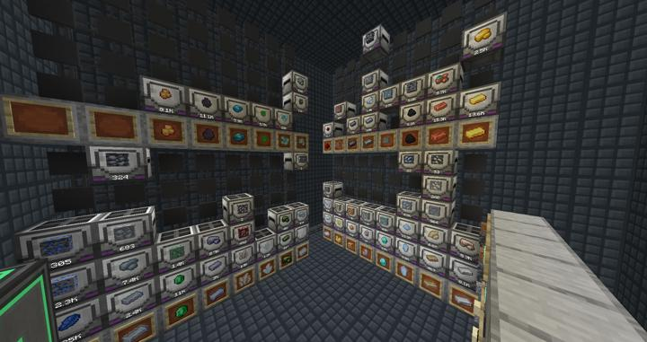

# 리파인드 스토리지 블랙홀 룸

대량 아이템 타입을 선별하여 따로 블랙홀 유닛으로 처리하는 곳.

기본적으로는 레이저 드릴로 인해 발생하는 엄청난 양의 자원들을 감당하기 위해 설계되었다. 

이 외에도 시스템에 부담을 줄 정도로 많이 보관하고 있는 자원들을 따로 담아서 RS main 네트워크의 스토리지를 불필요하게 장악하지 않도록 하는 것이 목적이다. 

### 시스템 설계 이유
RS 시스템의 기본 디스크는 그 저장 수량에 비해 지나치게 비싸다.  
하지만 각종 광물 및, 덜 희귀한 자원들(돌, 흙)등은 많게는 수십~수백만개 까지도 들어갈 수 있다.  
64k 스토리지 하나당 다이아를 비롯한 희귀 자원들이 수십개씩 필요함에도 불구하고, 
고작 64,000개의 아이템 밖에 저장하지 못한다는 것을 고려해야 한다.

리파인드 스토리지에는 외부 아이템 컨테이너와 상호작용하는 3가지의 방법을 가지고 있는데,
importer, exporter, external storage로 접근할 수 있다.  
exporter는 네트워크 내부의 아이템을 외부 아이템 컨테이터로 뿜어내는 역할을 하고,
external storage는 외부 아이템 컨테이너의 내용을 RS 아이템 네트워크에서 직접 엑세스 할 수 있게 만들어준다.

모드팩에는 한가지 or 몇가지 타입의 아이템만을 수십만개~ 수억개 까지 저장할 수 있는 블럭을 제공한다.
대표적으로 Thermal Expansion 모드이 Cache 블럭, Barrel블럭등이 있지만 
이중 단연 최고는 Industrial Foregoing 모드에서 추가하는 BlackHole Unit이다.

**블랙홀 유닛은 최고 티어의 경우 21억개 정도까지 그 아래 단계 역시도 6700만개 정도까지 저장된다.**

:::tip Note
int32 자료형의 최대치, 2^32-1 = 2,147,483,648 이며,  
어떻게 정했는진 모르겠지만, 2^25-1 = 67,108,863 이다.
:::

대부분의 경우 아무리 후반 테크여도 단일 아이템의 저장 용량이 천만개 단위로는 가지 않으므로, 블랙홀 유닛 advanced만으로도 충분히 감당 가능하다.

### External Storage와 Prority

익스터널 스토리지는 RS의 네트워크에서 외부 스토리지에 직접 접근할 수 있게 해준다. 이는 검색, 조합으로써 바로바로 안의 재료가 사용될 수 있기 때문에 사실상 외장하드와 같은 의미다. 

지금과 같은 대량의 단일 타입 아이템을 외장 스토리지에 저장할 때, 주의해야 하는것은 바로 저장공간의 Priority 설정이다.  
RS의 모든 저장소에는 우선순위값이 있어, 새로운 아이템이 들어거나 나갈 때, 동일한 아이템의 여러 군데에 저장되어 있다면 우선순위가 높은 저장장치에 우선 저장된다.

**기존의 대량 아이템을 이 방식으로 옮기는 경우**  
RS 내부에 있는 디스크 드라이브를 0으로 하고, 외장 스토리지의 우선순위를 -1로 한다.
대신 Exporter를 통해 RS 내부로부터 끊임없이 외장 스토리지로 아이템을 뱉도록 지정한다.  

이렇게 하면 외부에서 아이템이 들어오면 1차적으로 디스크 드라이브로 들어가지만, 바로 Exporter를 통해 외장 스토리지로 배출되며
아이템을 빼낼때는 디스크 드라이브에 애초에 아이템이 없으므로 우선순위가 -1인 외장 스토리지에서 아이템을 직접 가져가게 된다.  

RS 시스템 외부에서 볼때는 아이템의 개수가 전혀 변하지 않지만, 실제로는 점점 외장 스토리지 쪽으로 아이템이 옮겨가게 된다.

**외장 스토리지에만 아이템이 있는 경우**  
디스크 드라이브에 해당 타입의 아이템이 없는것을 확인한 후, External Storage의 우선순위를 디스크보다 높게 (ex, 1) 가져가면 된다.

이렇게 되면 입출력시 아예 내장 디스크 드라이브로 해당 타입의 아이템이 돌지 않게 되므로 제일 빠르다.  

대신, 만약 외장 스토리지의 한계를 초과할 경우 내장 디스크에 다시 아이템이 쌓이게 되며, 다시 아이템을 꺼낼때는 도로 외장 스토리지에서 먼저 꺼내므로, 내장 디스크에 아이템의 찌꺼기가 남을 수 있다.  
:::warning 
따라서 우선순위를 이렇게 전환한 경우, 반드시 외장 스토리지의 용량이 충분해야 함을 거듭 강조한다.
:::

### 2023-05-01 타입 고정 리뉴얼

블랙홀 스토리지 유닛에 들어가는 아이템 타입을 고정하는 기능이 있으나, 저장량이 0개일 경우 외부에 해당 아이템의 아이콘이 표시되지 않는 문제가 있다.

나중에 새로운 블랙홀 유닛을 추가할 때, 기존에 이미 추가되어있는 자원을 또 추가할 위험성이 있다. 따라서 다음과 같이 한줄씩 올리고, item frame을 사용해서 아래쪽 블랙홀 유닛의 아이템 종류를 표시하였다. 

### 2023-05-02 레이저 드릴 최적화 리뉴얼

레이저 드릴로 인해 발생하는 대량 자원들에 맞춰서 구조를 새롭게 변경하였다. 

### 위치
<!-- tag_source_open:link_list:building_spot -->
- 컴팩트 머신 차원
<!-- tag_close -->

### 위치
현재는 컴팩트 머신 방에 따로 분류되어 있으며,
텔레포터 허브를 통해 접근할 수 있다.

### 참여자
<!-- tag_source_open:link_list:member_contribute -->
- [jasuk500](../members/jasuk500.md)  
설계, 제작, 텔레포터 허브 연결
<!-- tag_close-->