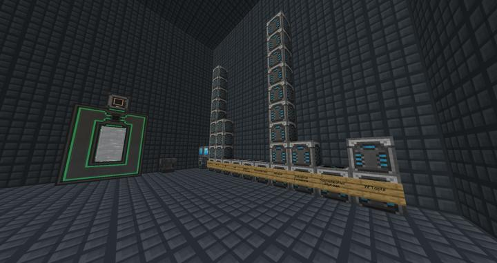
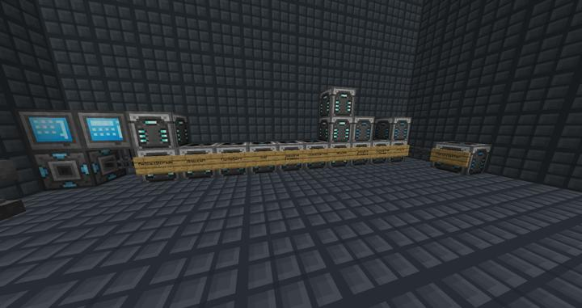
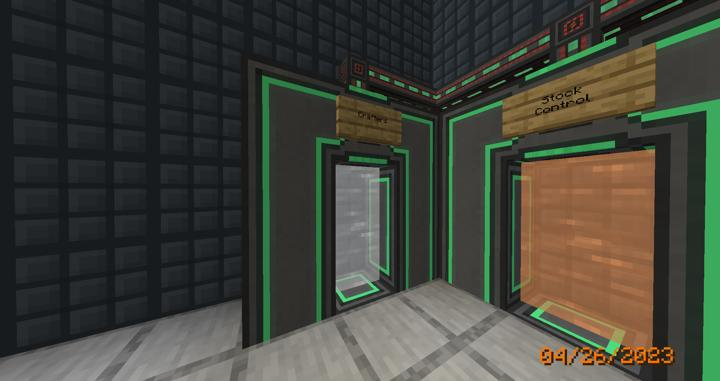

# 리파인드 스토리지 크래프터 룸

RS에서 사용하는 자동 조합법을 보관하는 방.

RS 시스템의  모든 자동 조합법은 전부 여기에 보관된다.

RS는 Crafter Manager라는 블럭을 통해, 네트워크에 연결된 모든 Crafter에 접근할 수 있다. 
이 과정에서 Crafter를 모루에 넣어 이름을 바꿀 경우, 그 이름으로 뜨게 되므로 훨씬 패턴을 넣을 곳을 찾기가 쉬워진다. 

하지만, 해당 크래프터의 속도를 가속시키거나, Crafting Upgrade를 넣는 등, 하드웨어 업그레이드에는 결국 그 Crafter가 물리적으로 위치한 장소를 쉽게 찾을 수 있어야 한다. 

따라서 다음과 같이 컴팩트 머신 방을 하나 만들고, 그곳에 모든 크래프터를 만들어 관리하고 있다.
또한, 서로 다른 컴팩트 머신 이름 그룹을 옆으로 나란히 세워서 구분하고 있다. 
만약 새로운 그룹을 추가한다면 옆에 새로 만들고 위로 쌓아 올리면 된다.

### 2023-05-01 Extra Storage 리뉴얼

엑스트라 스토리지 애드온이 깔림에 따라, 기존에 속도가 빠르고 용량이 컸던 crafter 그룹에 한해서 상위 티어의 크래프터로 업그레이드 했다.

네더라이트 크래프터는 네더라이트 블럭을 2개씩 요구하는 바람에 다이아몬드 크래프터를 채택하였다.

### 장소

현재 컴팩트 머신 방 안에 있으며, 텔레포터 허브를 통해 접근 가능하다

### 참여자
<!-- tag_source_open:link_list:member_contribute -->
- [jasuk500](../members/jasuk500.md)  
설계, 제작, 텔레포터 허브 연결
<!-- tag_close-->