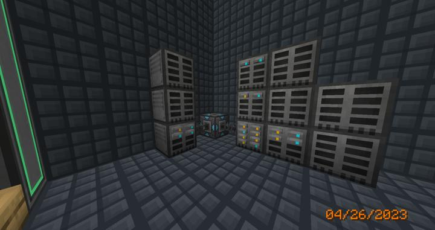
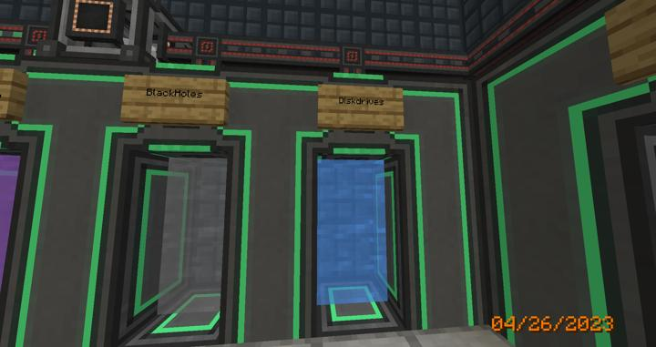

# 리파인드 스토리지 디스크 드라이브 룸

RS에서 사용하는 내부 디스크 메모리를 관리하기 위한 공간.

RS는 내부 디스크 드라이브를 통해 안에 들어오는 아이템을 저장할 수 있다. 

1k 4k 16k 64k의 4가지 종류의 아이템 디스크가 있으며, 
각각 하위의 디스크를 3개씩 요구하는 조합법으로 되어있다.  
정말 이름에 쓰여있는대로 그 개수만큼의 아이템을 종류 상관 없이 저장할 수 있으며, 
디스크 드라이브 슬롯에 꽃아 네트워크에 연결하여 안의 아이템을 네트워크에서 접근 가능하게 만들 수 있다.

RS 시스템의 잡다한 아이템들이 전부 저장되므로, 수량이 적고 희귀한 자원은 대게 이곳에 저장된다. 

:::tip Note
흙, 돌 등의 개수만 많고 실속이 떨어지는 자원들은 이 디스크 드라이브에 저장하기에는 대개 비효율 적인데, 이는 external storage를 사용하여 해결할 수 있다.
현재 우리 길드에서는 이를 위한 별도의 [BlackHole룸](rs_black_hole.md)을 설계하여 적용하였다.
:::

### 장소

현재 안전을 위해 별도의 컴팩트 머신 방을 할당하여 보관하고 있다.  
텔레포트 허브를 통해 이동할 수 있다.  

### 참여자
<!-- tag_source_open:link_list:member_contribute -->
- [jasuk500](../members/jasuk500.md)  
설계, 제작, 텔레포터 허브 연결
<!-- tag_close-->

