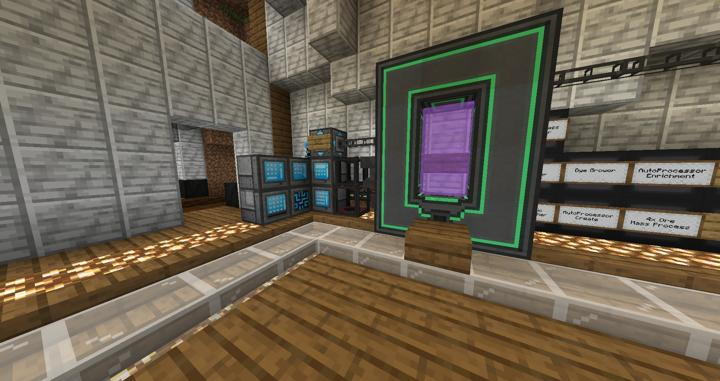
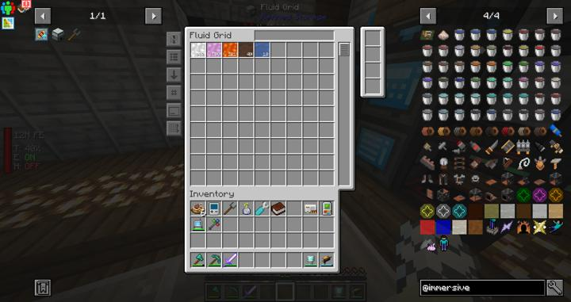
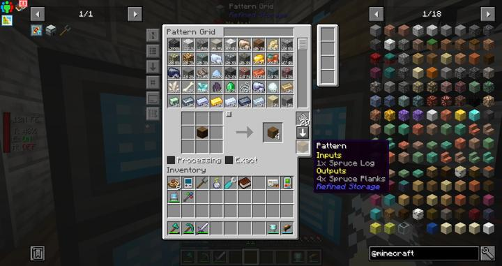
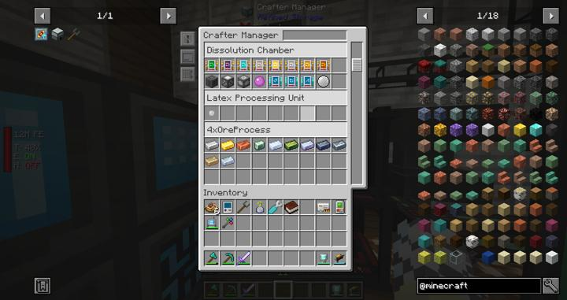
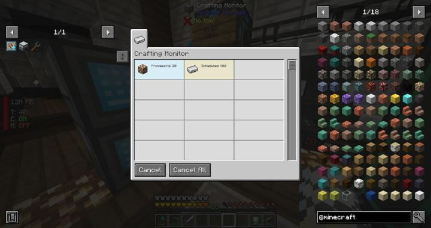

# 리파인드 스토리지 (메인)

리파인드 스토리지의 메인 컨트롤러가 위치한 장소

처음 이곳에서 리파인드 스토리지가 시작됐다.

<!-- tag_target_open:frame:item_stroage_generations -->
:::tip 아이템 스토리지 시스템 변천사
마인크래프트 기본 체스트 -> Storage Drawers ->[Occultism Magic Storage](occultism_magic_storage.md) -> [Refined Storage](rs_main.md)  
:::
<!-- tag_close -->
현재 우리 길드의 4세대 아이템 스토리지 시스템이자, 최종 단계이다.

Refined Storage는 기술모드의 꽃이자, 시스템 통합을 위한 필수 모드로 많은 모드팩에서 사용되고 있다.

그동안은 Storage Drawer등을 통해 어거지로 버티다가 한번에 RS 시스템으로 많이 넘어왔다면, 이번에는 사이에 Occultism 모드의 Magic Storage가 완충 작용을 도왔다.

하지만, 매직 스토리지 역시도 자동 조합 및 타 모드와의 연계성이 뛰어나지 않았으므로 여전히 조합에 많은 시간이 소모되었다. 
또한 네트워크 분산화가 힘들고, 용량을 확장하는데에도 한계가 명확하여 근 시일 내로 빠르게 RS 시스템으로 넘어가게 되었다.

## 시스템 사양
RS가 제공하는 기능은 다음과 같다.
- 아이템, 액체 저장 기능
- 네트워크 시스템을 사용하여, 저장되는 장소와 이를 접근하고 조작하는 장소가 서로 분리되어 있음.
- 외부 아이템 & 액체 스토리지와의 상호작용 및 네트워크 편입.
- 자동 조합 및 아이템 출력 지원
- 외부 프로세서(화로 등)을 사용할 수 있도록 하는 자동 프로세싱 지원
- 조합 또는 프로세싱에 필요한 자원이 없을 시, 해당 자원을 만들어내는 조합법이 있는지를 추가로 검사하는 재귀트리 조합 시스템 제공.
- 자동 조합 및 프로세싱 패턴 등록에 대한 체계화 및 무선화 지원
- 무선으로 네트워크에 접근하거나, 무선으로 확장 가능한 네트워크 제공

다음과 같이 무선으로 엑세스가 가능한 터미널을 제공하며, 조합 테이블 및 조합 요청도 보낼 수 있다. 또한, 오컬티즘의 매직 스토리지와 다르게 액체도 다룰 수 있다.

자동 조합은 다음과 같이 패턴 터미널에서 인코딩되며, 인코딩된 패턴을 Crafter안에 넣어서 등록하면 이제 RS 시스템에서 해당 조합법을 사용할 수 있게 된다.  

Crafter Manager를 사용하면 네트워크에 연결된 모든 Crafter에 접근할 수 있으며, 이를 통해 직접 Crafter에 접근하지 않아도 네트워크에 패턴 등록이 가능해진다.

Crafting Monitor는 시킨 자동 조합이 얼마나 진행되고 있는지를 확인할 수 있다.

## 업데이트 내역
### 2023-05-07 대규모 업데이트

이전

이후

## 타 문서와의 관계
### 위치
<!-- tag_source_open:link_list:building_spot -->
- [연구소 - 메카](../buildings/lab_meka_lab.md)
<!-- tag_close -->

# 참여
<!-- tag_source_open:link_list:member_contribute -->
- [jasuk500](../members/jasuk500.md)  
시스템 총괄 및 유지보수
- [BANJUHARA](../members/BANJUHARA.md)  
시스템 유지보수 및 기능 추가
<!-- tag_close -->