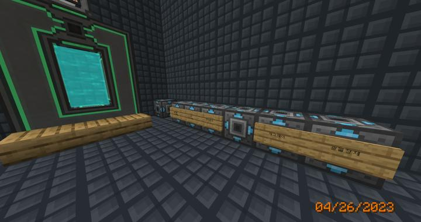
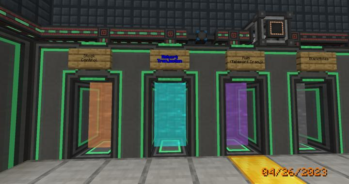

# 리파인드 스토리지 네트워크 트랜젝션

리파인드 스토리지의 무선 네트워크 연결 중앙화.

리파인드 스토리지의 모든 무선 네트워크 연결을 관리하기 위해 만든 공간이다.  
Compact machine의 방을 사용해서, 오버월드 및 다른 어떤 월드와도 독립적으로 동작하도록 하였다.

RS의 메인 컨트롤러 까지 컴팩트 머신 차원으로 옮기면, 나중에 해당 컴팩트 머신 방을 잃어버리면 영원히 RS를 고칠 수 없게 되는 리스크가 있으므로 옮기지 않았다.  
대신, RS를 완전히 무선화하고 모든 자동 프로세싱까지 미래에는 컴팩트 머신 안으로 옮겨서 관리하기 위해 각 방으로 네트워크가 뻗어나가는 것을 한곳에서 관리하도록 하였다.

**이 방법의 장점은 다음과 같다.**

- 오버월드에 속해 있지 않으므로, 길드를 옮기거나 이사를 할 때도 이 방 안의 기계들은 움직일 필요가 없다.

- 모든 무선 네트워크가 여기서만 관리되므로, 2다리 이상 걸쳐서 라우팅되는 네트워크를 최소화시켜 추후 네트워크 규모 파악 및 유지보수가 용이해진다.

### 장소

현재 안전을 위해 컴팩트 머신 차원을 따로 할당하여 관리중이다.
텔레포트 허브를 통해 이동할 수 있다.

### 참여자
<!-- player_desc_open -->
- [jasuk500](../members/jasuk500.md)  
총괄 및 유지보수 / 텔레포터 허브 연결
<!-- player_desc_close-->