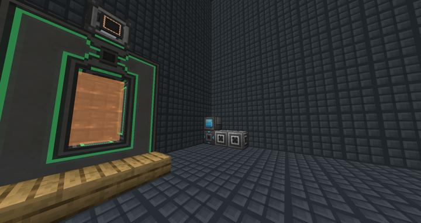
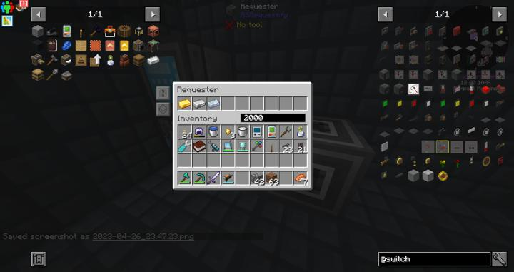
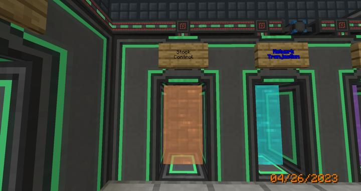

# 리파인드 스토리지 재고 제어

자동으로 아이템의 잔량을 조절하는 시스템

RS의 시스템은 자동 조합 시스템을 지원한다. 
또한, RS 내부의 아이템 수량에 따라 외부로 레드스톤 신호를 발생시키는 Detector 블럭을 제공한다. 
이를 사용하면 일정량의 아이템 재고를 자동으로 유지하도록 할 수 있다.

하지만 이 방법을 사용하면 각각의 아이템 제작라인에 레드스톤을 통해 구현해야 하므로, 중앙화가 불가능해 유지보수에 어려움이 따랐다. 
예를 들어, 조약돌의 유지 수량을 변경하려면 그 조약돌의 생산 라인에 가서 Detector의 컨피그 값을 바꿔줘야 한다.  
이러한 생산 라인이 대규모가 되면 매우 복잡한 상황을 초래하게 된다.

**우리는 Requestify라는 애드온을 통해 이 문제를 훨씬 간결하게 해결하였다.**

### Requestify 애드온

Requetify는 물리적으로 구현해야 했던 Detector를 통한 신호를 아예 RS 네트워크 내부적으로 동작할 수 있도록 해준다.  
딱 하나, Requestifier만을 추가하는데 UI는 다음과 같다.

이렇게 수량을 유지하길 원하는 조합법을 등록하고, 유지할 수량을 입력하면
해당 수량보다 적을 경우, 네트워크에 모자란 수만큼 자동 조합을 신청하도록 되어있다. 

이를 통해 재고 컨트롤의 중앙화가 가능해졌다.

### 장소

현재 컴팩트 머신 방을 할당하여 보관중이며,  
텔레포터 허브를 통해 이동 가능하다.

