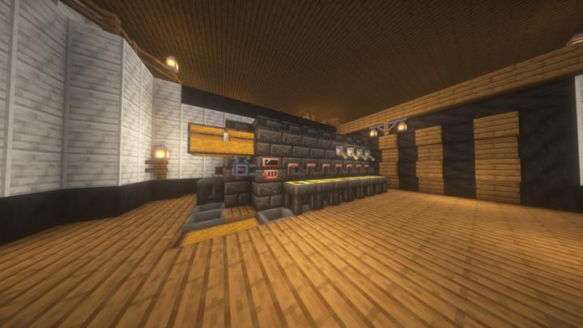
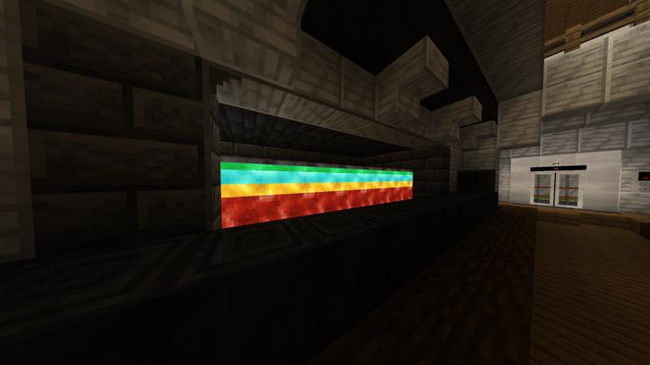

# 팅커스 컨스트럭트 용광로

내부에 여러 주형을 올릴수 있는 공간이 마련되어 있다.
외부에서 용광로 내부가 보인다.  

lab B2층에 위치하고 있다.

## 타 문서와의 관계
### 위치
<!-- tag_source_open:link_list:building_spot -->
-  길드 지하 2층
<!-- tag_close -->

### 참여자
<!-- tag_source_open:link_list:member_contribute -->
- [happyjourney](../members/happyjourney.md)   
시스템 설계 및 제작
<!-- tag_close-->