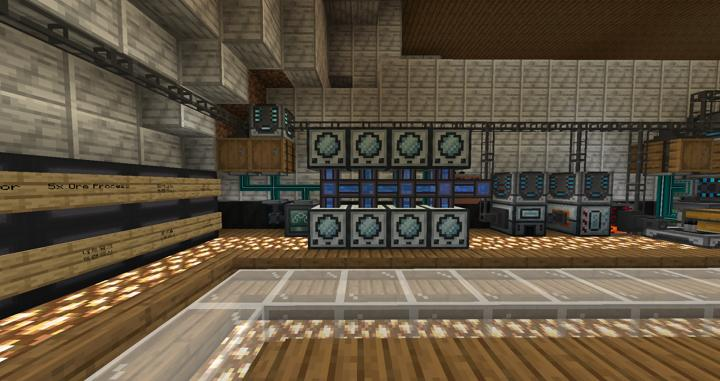

# 써멀 익스팬션 자동 플루이드 인캡슐레이터 - 물

RS에 연결되어 자동으로 돌아가는 플루이드 인캡슐레이터

현재 물을 사용하는 조합만 빠르게 사용 가능하다.

앞으로의 건축에 사용될 대량의 콘크리트를 처리하기 위해 설계되었다. 

처음에는 Create 모드의 Enchased Fan을 사용하자는 이야기가 나왔으나, 다음과 같은 이유들로 불발되었다.

- 아이템 엔티티가 많아지면 서버에 랙을 유발할 것
- 64개 이상으로 만들면 무조건 1분씩 기다려야 함
- 아이템을 빠르게 1스택씩 아이템화 시켜서 떨어트리는 방법이 많지 않음

:::tip
물은 Cooking For Blockheads 라는 요리 모드의 Sink 블럭에서 뽑아쓰고 있다.  
이 블럭은 진짜 무슨 생각인지, 내부에 21억버킷의 물이 들어있어서 사실상 무한 물 소스로 활용 가능하다.
:::

## 타 문서와의 관계
### 위치
<!-- tag_source_open:link_list:building_spot -->
- [연구소 - 메카](../buildings/lab_meka_lab.md)
<!-- tag_close -->

### 참여자
<!-- tag_source_open:link_list:member_contribute -->
- [jasuk500](../members/jasuk500.md)  
시스템 설계 및 제작
<!-- tag_close-->