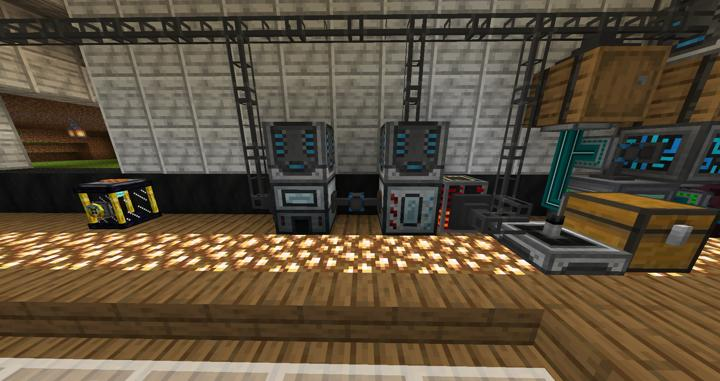

# 써멀 익스팬션 자동 인덕션 스멜터

RS에 연결된 인덕션 스멜터리

써멀 익스팬션 모드를 개척하면서 제작되었다.

필요한 수가 많지도 않고, 자주 사용하지도 않아서 1대만 놓았다.

원래대로라면 써멀 익스팬션모드에서만 추가하는 다양한 합금을 만들어야 하지만, 그 합금들을 자동화하는 과정이 지나치게 빡세서 치워버렸다. 

예시로, 철+금 / 철+글로우스톤 등을 사용하는 레시피가 같은 crafter에서 나오게 되면, 철+금+글로우스톤이 한번에 다 들어가 버려 기계가 멈추게 된다.

또 다른 문제는 이런 아이템 조합 파이핑 때문에 병렬처리가 매우 힘들어진다는 것이다. 다른건 몰라도 합금을 굽는 시스템이 병렬 처리가 힘들다는건 정말 큰 단점이다.

이에 우리는 인덕션 스멜터를 아예 배제하고 만드는 방법을 택했다. 주괴->(병렬 크러셔)->가루->(다이아몬드 크래프터)->블렌드 가루->(병렬 스멜터리)->합금의 다소 빙 돌아가는 공정이다. 하지만 이 방법에 사용되는 자동 프로세서들의 속도가 워낙 빠르기 때문에 이게 훨씬 낫다는 결론을 내렸다. 

현재는 딱 1개의 조합법, hardened glass 만을 만드는데 쓰이고 있다.

### 위치
<!-- tag_source_open:link_list:building_spot -->
- [연구소 - 메카](../buildings/lab_meka_lab.md)
<!-- tag_close -->

### 참여자
<!-- tag_source_open:link_list:member_contribute -->
- [jasuk500](../members/jasuk500.md)  
시스템 설계 및 제작
<!-- tag_close-->