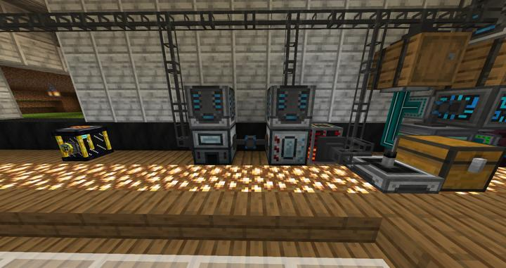

# 써멀 익스팬션 자동 마그마 크루시블

RS에 연결된 마그마 크루시블

전기를 줘서 다양한 아이템을 액체로 녹이는 기계.

현재 용도는 조약돌을 녹여서 용암으로 만드는 것이다.
용암을 지옥에서 퍼올리면 되긴 하지만, 엔더 탱크가 가끔 버그에 걸려서 용암 공급이 자주 끊겼는데, 아예 RS에 잘 맞는 자동화 시스템으로 변경할 겸 제작되었다.

수량 제어는 requesify를 사용하였다.

### 위치
<!-- tag_source_open:link_list:building_spot -->
- [연구소 - 메카](../buildings/lab_meka_lab.md)
<!-- tag_close -->

### 참여자
<!-- tag_source_open:link_list:member_contribute -->
- [jasuk500](../members/jasuk500.md)  
시스템 설계 및 제작
<!-- tag_close-->