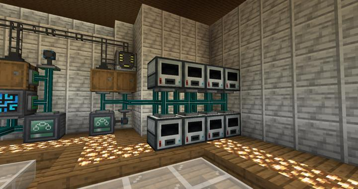

# 써멀 익스팬션 자동 멀티서보 프레스

금속의 형태를 가공하는 곳

써멀 익스팬션의 멀티서보 프레스를 사용하여 다양한 금속을 판 형태로 가공한다. 

RS 시스템에 병합되어 현재 8코어의 최상위 티어 기계들이 구비되어 있다. 
원래는 create로 사용될 metal plate들을 만들려고 했지만, 너무 부피가 크고 관리가 힘드므로 써멀 익스팬션의 이 기계로 대체되었다.

## 타 문서와의 관계
### 위치
<!-- tag_source_open:link_list:building_spot -->
- [연구소 - 메카](../buildings/lab_meka_lab.md)
<!-- tag_close -->

### 참여자
<!-- tag_source_open:link_list:member_contribute -->
- [jasuk500](../members/jasuk500.md)  
시스템 설계 및 제작
<!-- tag_close-->