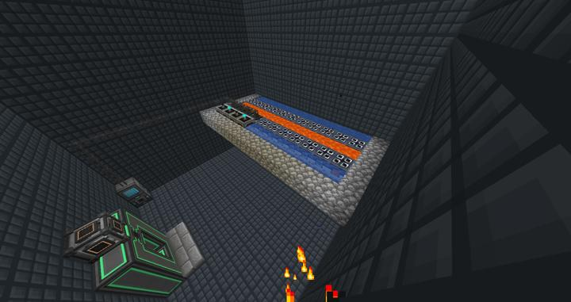
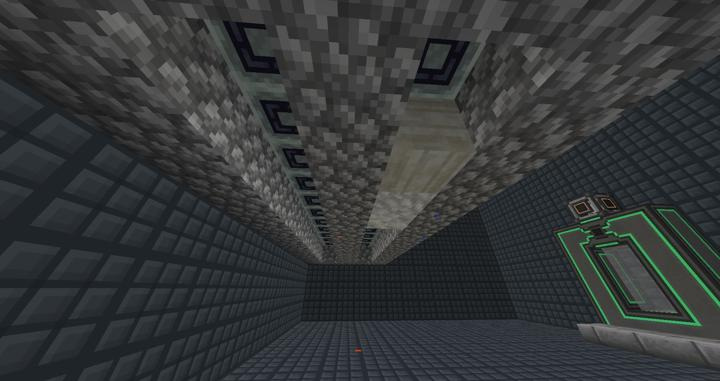

# 써멀 익스팬션 자동 스톤 익스트루더

다양한 종류의 돌을 무한으로 뽑아내는 곳

써멀 익스팬션의 Igneous Extruder를 사용하여, 다양한 종류의 돌을 생성하는 곳이다. 

이그니우스 익스트루더는 전 버전에서는 물과 용암을 직접 소비했지만, 1.18버전에서는 양 옆에 물과 용암 소스가 놓이면 자동으로 계속 뽑히도록 바뀌었다. 원하는 돌 종류가 이젠 너무 많아졌는지, 이그니우스 익스트루더 바닥에 놓인 돌 종류에 따라서 나오는 돌도 바뀌도록 변경되었다.

:::tip
Entalgled 블럭을 사용하여 깔끔하게 정리해보려 했지만, 인탱글드 블럭은 에너지나 아이템이 들어가는 파이핑만 원격으로 전해질 뿐, 블럭 근처에 어떤 블럭이 있는지 감지하는 코드와는 상관이 없는 것처럼 보였다.
:::

아직은 필요한 돌 종류가 많지 않지만, 쉽게 추가할 수 있도록 칸을 만들어 놓았다.
현재 이그니우스 익스트루더의 조합법은 총 65개이며, 현재 22개의 칸이 만들어진 상태이다. 

### 위치
<!-- tag_source_open:link_list:building_spot -->
- 컴팩트 머신 차원
<!-- tag_close -->

### 참여자
<!-- tag_source_open:link_list:member_contribute -->
- [jasuk500](../members/jasuk500.md)  
시스템 설계 및 제작
<!-- tag_close-->