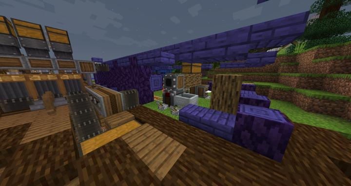
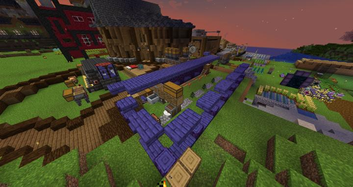

# 나무 농장 (크리에이트 카트)

처음으로 지어진 나무 농장.  

크리에이트의 카트 어셈블러를 사용하여 간단하게 제작되었다.  
파워드 레일을 깔고, 양옆으로 계속 왔다갔다 하면서 자동으로 묘목을 심고 자른다.   
만들어진 나무는 크리에이트 모드의 인터페이스를 통해 외부로 빼내진다.

  

:::warning
서버의 상태가 좋지 않아 종종 서버 재부팅 후 렉걸리며 허공에 멈춰있는 모습이 종종 확인되었다.
:::

:::tip Future Work
추후 Create를 통해서 정적으로 나무를 기르거나, Industrial Foregoing의 Planter를 사용하여 자동화 수준을 올려야 한다.
:::

## 타 문서와의 관계
### 위치
<!-- tag_source_open:link_list:building_spot -->
- 길드 주변
<!-- tag_close -->

## 참여자
<!-- tag_source_open:link_list:member_contribute -->
- [jasuk500](../members/jasuk500.md)  
기획 및 시스템 개발
- [happyjourney](../members/happyjourney.md)  
케이싱 데코
<!-- tag_close -->